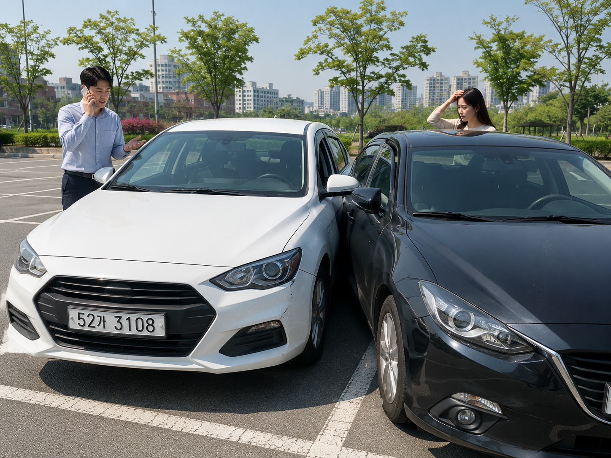
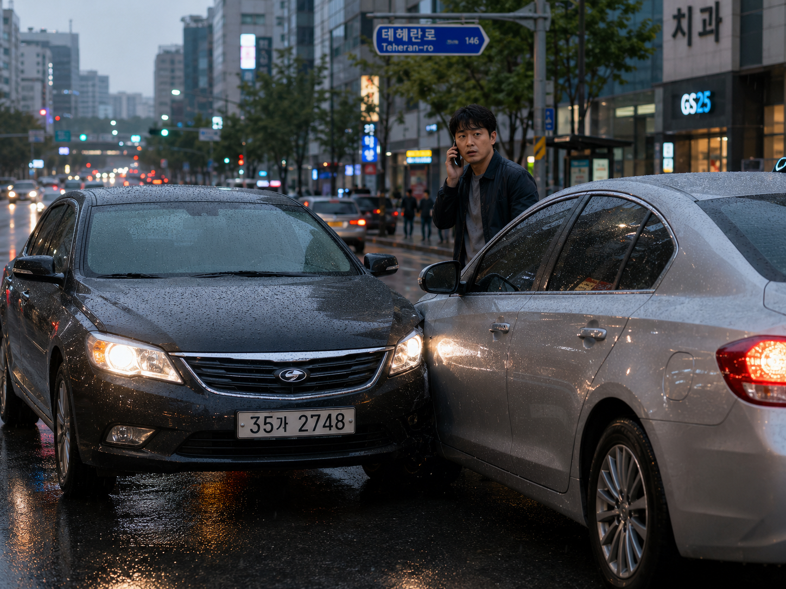
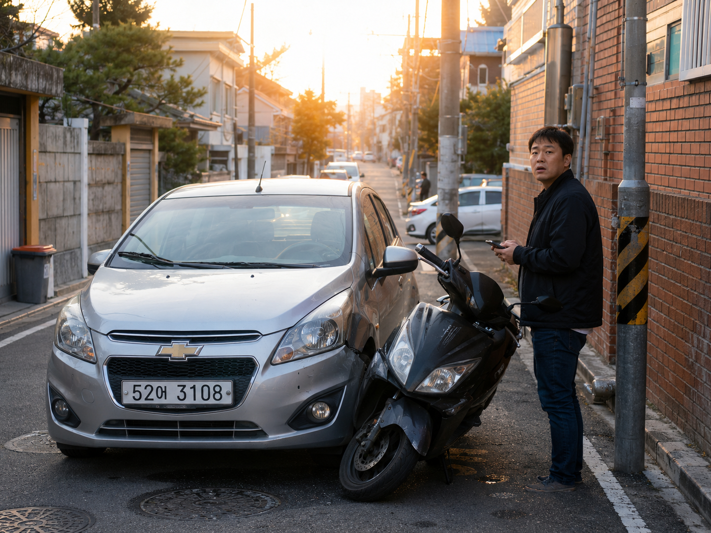
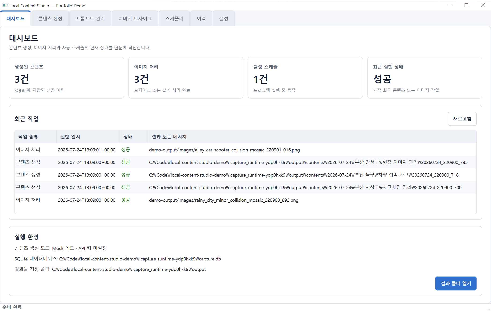
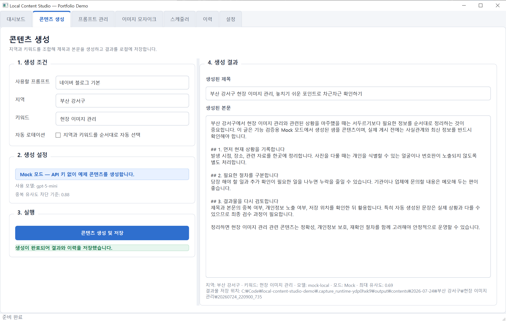
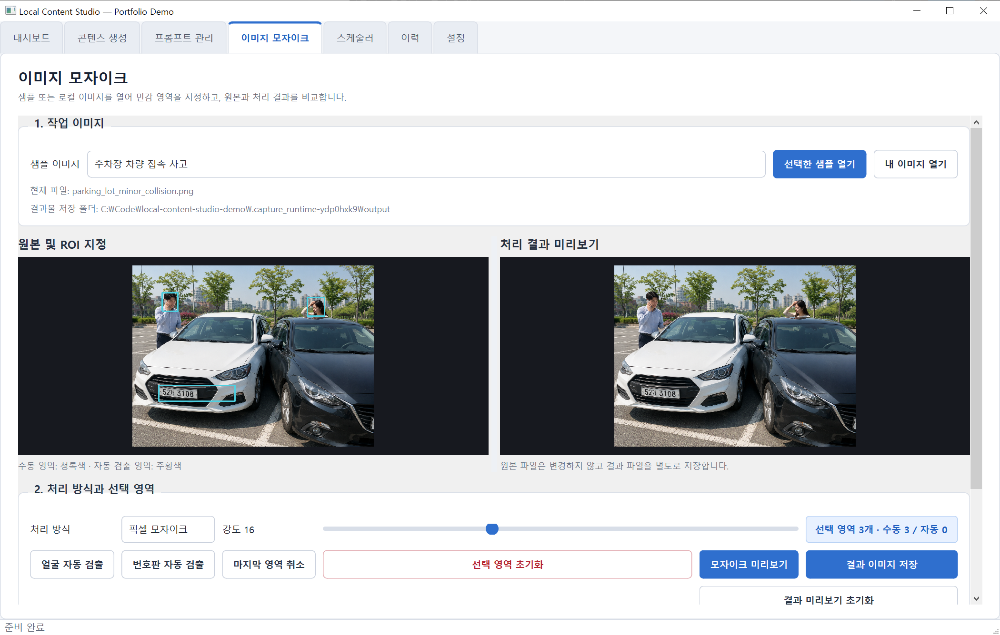
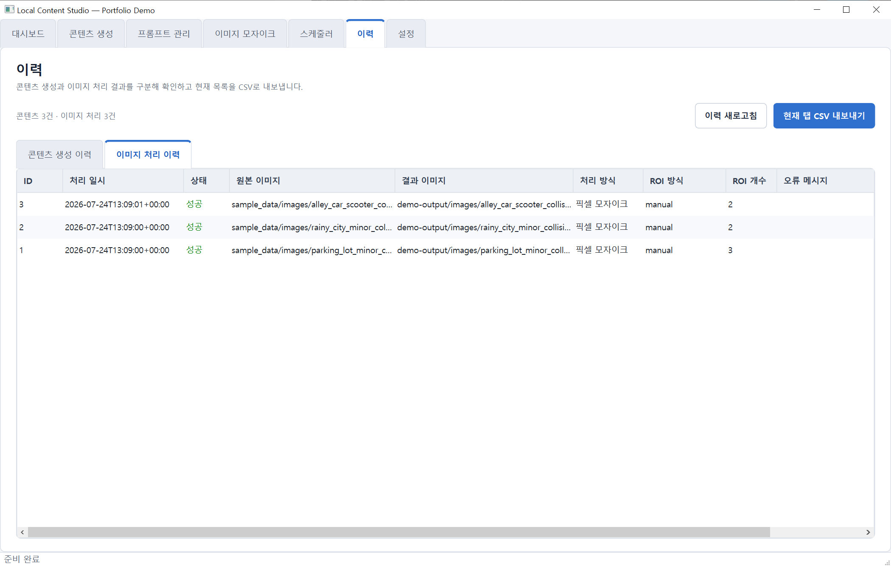
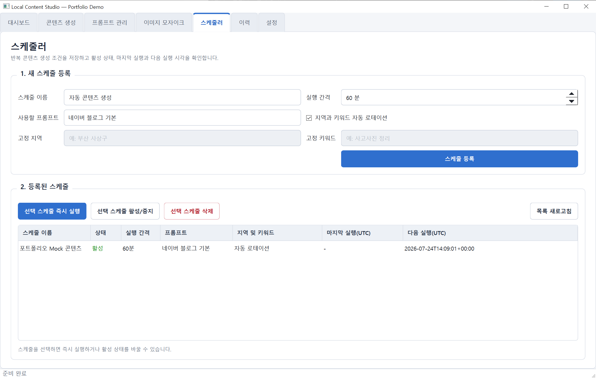
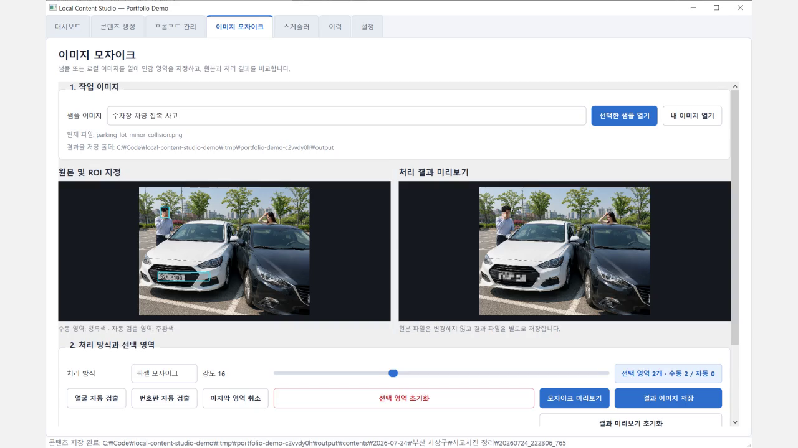

# Local Content Studio

Windows 환경에서 콘텐츠 생성, 로컬 이미지 모자이크, 생성 이력과 자동 스케줄을 관리하는 데스크톱 자동화 데모

이 프로젝트는 제가 Cognex 관련 업무에서 접한 로컬 이미지 처리 흐름을 공개 가능한 형태로 다시 구성한 Windows 데스크톱 포트폴리오입니다. 실제 회사나 고객사의 소스코드·이미지·설비 정보는 사용하지 않았습니다. 대신 PySide6, OpenCV, SQLite를 중심으로 콘텐츠 생성부터 이미지 비식별 처리, 결과 저장과 이력 확인까지 한 프로그램에서 실행할 수 있도록 새로 구현했습니다.

## 프로젝트를 만든 이유

Cognex 관련 업무를 하면서 이미지를 입력하고, 필요한 영역을 처리한 뒤, 화면에서 결과를 확인하고 파일로 남기는 흐름을 경험했습니다. 이 경험을 포트폴리오에 담을 때 실제 업무 자료를 공개할 수는 없었기 때문에, 같은 종류의 문제를 다루되 코드와 데이터는 처음부터 개인 프로젝트로 다시 만들었습니다.

이번 프로젝트에서는 OpenCV로 이미지를 로컬에서 처리하는 기능에 콘텐츠 생성과 자동화 흐름을 연결했습니다. 단순히 화면만 구성한 UI 목업이 아니라 Mock 콘텐츠 생성, 이미지 모자이크, SQLite 기록, 반복 스케줄과 결과 파일 저장을 직접 실행해 볼 수 있는 데모입니다.

## 프로젝트 미리보기

<table>
  <tr>
    <td width="33%">
      
    </td>
    <td width="33%">
      
    </td>
    <td width="33%">
      
    </td>
  </tr>
  <tr>
    <td align="center">
      주차장 차량 접촉 사고<br>
      <sub>얼굴 및 차량 번호판 모자이크 시연</sub>
    </td>
    <td align="center">
      비 오는 도심 접촉 사고<br>
      <sub>번호판과 인물 영역 처리 시연</sub>
    </td>
    <td align="center">
      골목 차량·오토바이 사고<br>
      <sub>수동 ROI와 로컬 이미지 처리 시연</sub>
    </td>
  </tr>
</table>

위 세 장은 프로그램 시연을 위해 AI로 생성한 가상의 사고 이미지입니다. 실제 사고 현장이나 실제 개인정보가 아니며, 얼굴과 번호판 모자이크 기능을 테스트하기 위한 샘플로만 사용합니다. 실제 인물 사진이나 고객사 데이터는 저장소에 포함하지 않았습니다.

## 실행 화면

아래 이미지는 별도의 Mock 데이터와 새 사고 샘플을 사용해 실제 PySide6 프로그램을 실행한 화면입니다.

<table>
  <tr>
    <td width="50%">
      
    </td>
    <td width="50%">
      
    </td>
  </tr>
  <tr>
    <td align="center">콘텐츠·이미지 처리·스케줄 상태를 한눈에 확인합니다.</td>
    <td align="center">지역과 키워드를 조합해 콘텐츠를 생성하고 로컬에 저장합니다.</td>
  </tr>
  <tr>
    <td width="50%">
      
    </td>
    <td width="50%">
      
    </td>
  </tr>
  <tr>
    <td align="center">민감 영역을 직접 지정하고 ROI 개수를 확인합니다.</td>
    <td align="center">원본과 모자이크 결과를 좌우로 비교합니다.</td>
  </tr>
  <tr>
    <td width="50%">
      
    </td>
    <td width="50%">
      
    </td>
  </tr>
  <tr>
    <td align="center">성공 상태, 처리 시각, ROI와 결과 경로를 확인합니다.</td>
    <td align="center">반복 조건과 활성 상태, 다음 실행 시각을 관리합니다.</td>
  </tr>
</table>

## 시연 영상

<a href="docs/assets/demo/local-content-studio-demo.mp4">
  
</a>

영상에서는 실제 PySide6 앱을 실행해 다음 흐름을 시연합니다.

- Mock 콘텐츠 생성과 결과 저장
- 얼굴·번호판 수동 ROI 지정
- 픽셀 모자이크와 가우시안 블러
- SQLite 콘텐츠·이미지 처리 이력
- 스케줄러와 프로그램 설정

[▶ Local Content Studio 시연 영상 보기](docs/assets/demo/local-content-studio-demo.mp4)

## 주요 기능

- **PySide6 기반 Windows 데스크톱 UI**

  콘텐츠 생성, 프롬프트 관리, 이미지 모자이크, 스케줄러, 이력과 설정을 탭으로 나눴습니다.
- **OpenAI API 및 Mock 콘텐츠 생성**

  제목과 본문을 생성하고 사용한 프롬프트·지역·키워드·모델 정보를 함께 기록합니다. 처음 실행할 때는 Mock 모드가 켜져 있어 API 키 없이 흐름을 확인할 수 있습니다.
- **TXT 프롬프트와 순차 로테이션 관리**

  프롬프트를 등록·수정·삭제하거나 TXT 파일에서 가져올 수 있고, 지역과 키워드를 순서대로 바꿔 가며 생성할 수 있습니다.
- **중복 콘텐츠 방지**

  정규화한 제목과 본문의 SHA-256 해시를 비교하고, 최근 결과와 문자열 유사도를 계산해 중복 생성을 막습니다.
- **SQLite 기반 로컬 이력 관리**

  별도 서버 없이 콘텐츠 생성, 이미지 처리, 오류와 반복 스케줄 정보를 저장합니다. 현재 탭의 이력은 CSV로 내보낼 수 있습니다.
- **반복 실행 스케줄러**

  프로그램이 실행 중일 때 저장된 주기를 확인해 콘텐츠 생성 작업을 실행하며, 즉시 실행과 활성화 전환도 지원합니다.
- **OpenCV 수동 ROI 모자이크**

  새 샘플 3장을 한국어 이름으로 바로 열 수 있습니다. 사용자가 이미지에서 민감 영역을 직접 드래그하고 픽셀 모자이크 또는 가우시안 블러를 적용하면 원본과 결과를 좌우로 비교할 수 있습니다.
- **얼굴·번호판 보조 검출과 일괄 처리**

  OpenCV Haar Cascade 검출 결과를 ROI에 추가할 수 있고, 폴더 단위 처리는 작업 스레드에서 실행합니다. 자동 검출은 확인이 필요한 보조 기능입니다.
- **한글 경로 이미지 입출력과 원본 보호**

  한글이 포함된 경로에서도 이미지를 읽고 저장하며, 결과 파일은 원본과 분리해 만듭니다.
- **로컬 동기화 폴더 저장**

  결과 폴더를 Google Drive Desktop 등과 동기화되는 로컬 폴더로 지정할 수 있습니다.
- **PyInstaller Windows EXE 빌드**

  제공된 PowerShell 스크립트로 테스트 후 `onedir` 방식의 실행 파일을 만들 수 있습니다.

## 실제 사용 흐름

1. 프롬프트를 준비하고 콘텐츠에 사용할 지역과 키워드를 설정합니다.
2. Mock 모드 또는 OpenAI API로 제목과 본문을 생성합니다.
3. 생성 결과와 사용 조건, 성공·실패 상태를 SQLite에 기록하고 결과 파일을 저장합니다.
4. 샘플 사고 이미지를 불러와 얼굴이나 번호판 영역을 직접 선택하거나 보조 검출을 실행합니다.
5. OpenCV로 픽셀 모자이크 또는 가우시안 블러를 적용하고 미리보기를 확인합니다.
6. 원본과 분리된 결과물을 일반 폴더나 Google Drive Desktop 동기화 폴더에 저장합니다.
7. 이력 화면에서 처리 시각, ROI 개수, 성공·실패 상태와 결과 경로를 확인합니다.

## 이미지 모자이크 데모

다음 세 파일을 샘플 데이터로 제공합니다.

- `sample_data/images/parking_lot_minor_collision.png`
- `sample_data/images/rainy_city_minor_collision.png`
- `sample_data/images/alley_car_scooter_collision.png`

사용 순서는 다음과 같습니다.

1. `이미지 모자이크` 탭에서 샘플 이미지 중 하나를 엽니다.
2. 얼굴이나 번호판을 마우스로 드래그해 ROI를 만듭니다.
3. 픽셀 모자이크 또는 가우시안 블러를 선택하고 강도를 조절합니다.
4. `미리보기 적용`으로 결과를 확인합니다.
5. `결과 저장`을 눌러 원본과 별도의 파일로 저장합니다.
6. `이력` 탭에서 처리 시각, ROI 개수, 처리 방식과 결과 경로를 확인합니다.

얼굴과 번호판 자동 검출은 수동 작업을 줄이기 위한 보조 기능입니다. 특히 번호판 검출은 한국 번호판에 맞춘 고정밀 모델이 아니므로, 검출 결과를 직접 확인하고 수동 ROI로 보정하는 과정을 최종 안전장치로 두었습니다.

## 실행 방법

권장 환경은 Windows 10·11과 Python 3.11 또는 3.12입니다. PowerShell 실행 정책에 따라 가상환경 활성화 스크립트가 막힐 수 있어, 아래처럼 가상환경의 Python 실행 파일을 직접 사용하는 방법을 우선 권장합니다.

```powershell
cd C:\Code\local-content-studio-demo

py -3.12 -m venv .venv

.\.venv\Scripts\python.exe -m pip install --upgrade pip
.\.venv\Scripts\python.exe -m pip install -r requirements.txt

.\.venv\Scripts\python.exe -m app
```

가상환경 생성, 패키지 설치와 프로그램 실행을 한 번에 처리하려면 다음 스크립트를 사용할 수 있습니다.

```powershell
powershell -ExecutionPolicy Bypass -File .\scripts\run_windows.ps1
```

처음 실행할 때는 Mock 모드가 기본으로 켜져 있습니다. OpenAI API 키가 없어도 콘텐츠 생성, 저장, 이미지 처리와 이력 확인 등 주요 기능을 시연할 수 있습니다.

### OpenAI API 설정

실제 API를 사용하려면 예제 환경 파일을 복사하고 발급받은 키를 로컬 `.env` 파일의 `OPENAI_API_KEY`에 설정합니다.

```powershell
Copy-Item .env.example .env
notepad .env
```

그다음 프로그램의 `설정` 탭에서 `API 키 없이 로컬 Mock 콘텐츠 생성`을 끄고 사용할 수 있는 텍스트 모델명을 확인합니다. `.env` 대신 설정 탭의 세션 API 키 입력란을 사용하면 현재 프로세스 메모리에만 적용됩니다.

API 키는 코드나 SQLite에 저장하지 않으며 `.env`는 `.gitignore`에서 제외합니다. 키가 포함된 파일은 커밋하지 않아야 합니다.

### 결과 저장 구조

기본 결과 폴더는 사용자 문서 폴더의 `LocalContentStudioOutput`입니다. 설정 탭에서 다른 경로로 변경할 수 있습니다.

```text
LocalContentStudioOutput/
├─ contents/
│  └─ YYYY-MM-DD/지역/키워드/YYYYMMDD_HHMMSS_mmm/
│     ├─ title.txt
│     ├─ body.md
│     └─ metadata.json
└─ images/
   └─ YYYY-MM-DD/
      └─ 원본파일명_mosaic_HHMMSS_mmm.png
```

Google Drive와 연결할 때는 Drive API를 직접 호출하지 않습니다. Google Drive Desktop이 동기화하는 로컬 폴더를 `설정 → 결과 저장 폴더`로 지정하는 방식입니다.

## 프로젝트 구조

```text
local-content-studio-demo/
├─ app/
│  ├─ __main__.py
│  ├─ config.py
│  ├─ database.py
│  ├─ models.py
│  ├─ services/
│  │  ├─ batch_service.py
│  │  ├─ content_service.py
│  │  ├─ image_service.py
│  │  ├─ openai_service.py
│  │  ├─ scheduler_service.py
│  │  └─ storage_service.py
│  └─ ui/
│     ├─ components.py
│     ├─ main_window.py
│     ├─ content_page.py
│     ├─ image_page.py
│     ├─ prompt_page.py
│     ├─ schedule_page.py
│     ├─ history_page.py
│     ├─ settings_page.py
│     ├─ style.py
│     └─ workers.py
├─ sample_data/
│  └─ images/
│     ├─ parking_lot_minor_collision.png
│     ├─ rainy_city_minor_collision.png
│     └─ alley_car_scooter_collision.png
├─ scripts/
│  ├─ build_exe.ps1
│  ├─ capture_portfolio_screenshots.py
│  ├─ record_portfolio_demo.py
│  ├─ run_tests.ps1
│  └─ run_windows.ps1
├─ tests/
├─ docs/
│  ├─ assets/
│  │  ├─ screenshots/
│  │  └─ demo/
│  │     ├─ local-content-studio-demo.mp4
│  │     └─ video-thumbnail.png
│  └─ capture_guide.md
├─ requirements.txt
└─ requirements-dev.txt
```

## 구현하면서 고려한 부분

- 저는 원본 이미지를 직접 수정하지 않고 결과 파일을 별도 경로에 저장하도록 구성했습니다.
- 이미지 처리나 저장이 실패해도 원본 파일은 그대로 남고, 실패 상태와 오류 메시지는 이력에 기록됩니다.
- OpenCV의 일반적인 파일 읽기 방식에서 문제가 생길 수 있는 한글 경로를 위해 바이트 기반 입출력을 사용했습니다.
- API 호출과 폴더 일괄 처리는 Qt 작업 스레드로 분리해 UI 이벤트 처리를 막지 않도록 했습니다.
- 서버를 추가하지 않고 SQLite만으로 콘텐츠, 이미지, 오류와 스케줄 이력을 관리했습니다.
- 자동 검출 결과만 신뢰하지 않고 사용자가 영역을 추가·취소할 수 있는 수동 보정 기능을 제공했습니다.

## 테스트

개발용 의존성을 설치한 뒤 다음 명령으로 테스트를 실행할 수 있습니다.

```powershell
.\.venv\Scripts\python.exe -m pip install -r requirements-dev.txt
.\.venv\Scripts\python.exe -m pytest -q
```

현재 포함된 10개 테스트가 모두 통과합니다. 테스트는 DB 초기화와 로테이션·스케줄, Mock 콘텐츠 생성과 중복 차단, 결과 파일 저장, 모자이크 ROI 처리와 한글 이미지 경로 읽기, 주요 PySide6 위젯 생성과 샘플 이미지 미리보기를 확인합니다.

## Windows EXE 빌드

```powershell
powershell -ExecutionPolicy Bypass -File .\scripts\build_exe.ps1
```

빌드 스크립트는 개발 의존성을 설치하고 테스트를 실행한 뒤 PyInstaller `--onedir` 방식으로 패키징합니다. 성공하면 다음 위치에 실행 파일이 만들어집니다.

```text
dist\LocalContentStudio\LocalContentStudio.exe
```

실행 파일을 전달할 때는 DLL과 리소스가 함께 있는 `dist\LocalContentStudio` 폴더 전체가 필요합니다.

## 현재 범위와 제한사항

- 네이버 자동 포스팅은 포함하지 않았습니다.
- 웹 서비스가 아닌 Windows 데스크톱 데모입니다.
- 반복 스케줄은 프로그램이 실행 중일 때만 동작합니다.
- 얼굴과 번호판 자동 검출은 데모를 위한 보조 기능이며 모든 이미지를 정확하게 찾는다고 보장하지 않습니다.
- 한국 번호판 고정밀 검출은 별도의 데이터와 전용 모델 검증이 필요합니다.
- 새로운 AI 검출 모델을 학습하는 작업은 현재 범위에 포함하지 않았습니다.
- AI가 생성한 콘텐츠는 게시하기 전에 사용자가 사실관계와 표현을 검수해야 합니다.

## 보안과 개인정보 처리

- 회사 및 고객사의 소스코드, 설비 정보와 이미지를 포함하지 않았습니다.
- 실제 사고 사진이나 실제 개인정보가 담긴 사진을 포함하지 않았습니다.
- 샘플 이미지는 포트폴리오 시연을 위해 AI로 생성한 가상 데이터입니다.
- API 키는 Git, 코드와 SQLite에 저장하지 않습니다.
- `.gitignore`로 `.env`, DB, 로그, 결과 폴더와 빌드 산출물을 제외합니다.

이 저장소는 콘텐츠 생성과 OpenCV 이미지 처리, 로컬 이력 관리가 Windows 프로그램 안에서 어떻게 연결되는지 직접 실행하고 확인할 수 있도록 구성했습니다.
